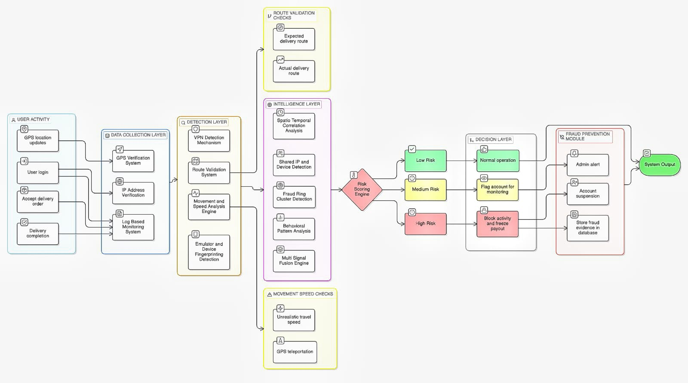
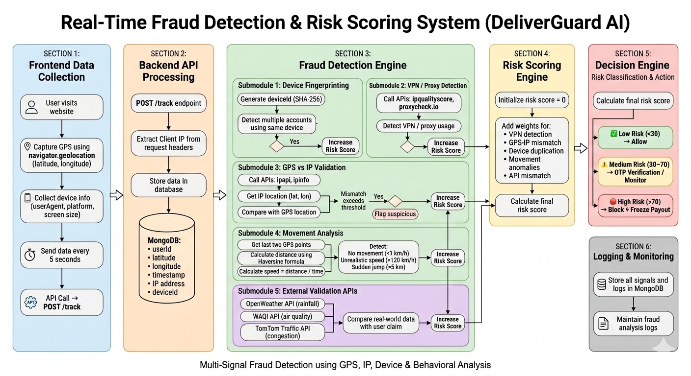
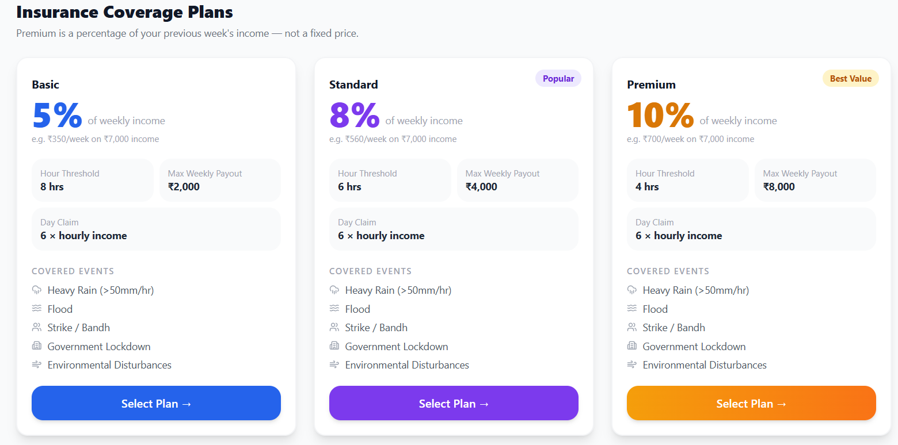
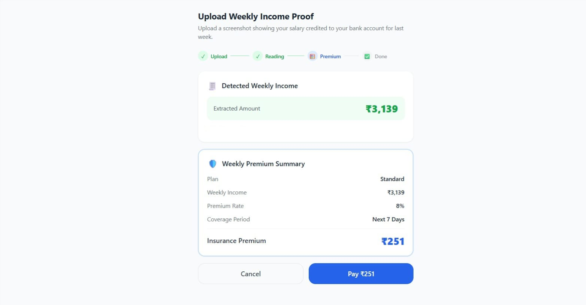
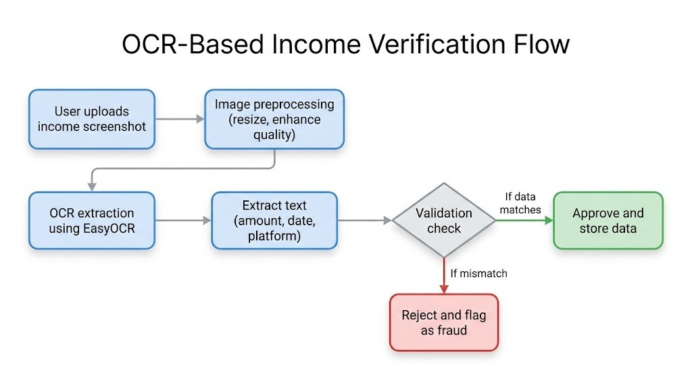
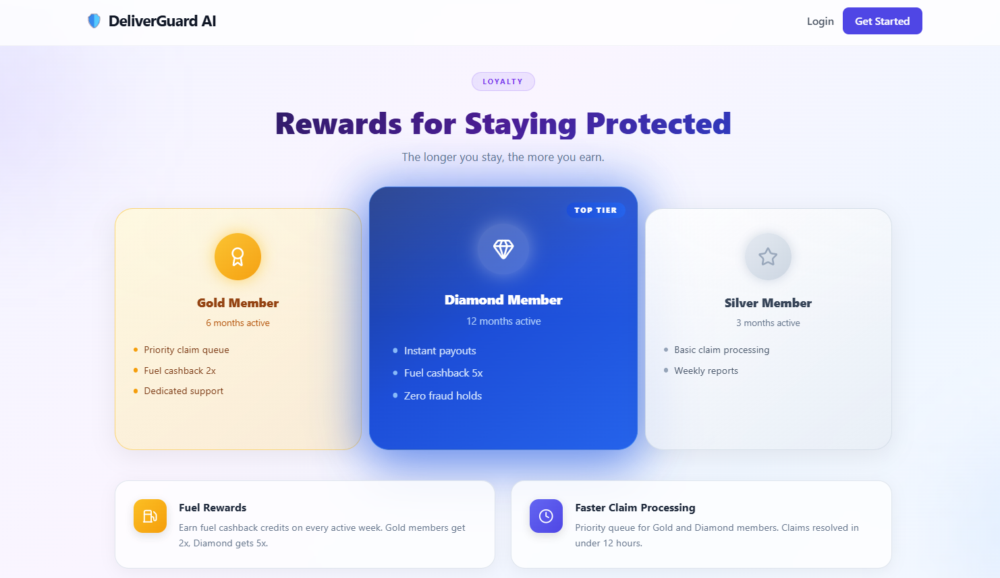
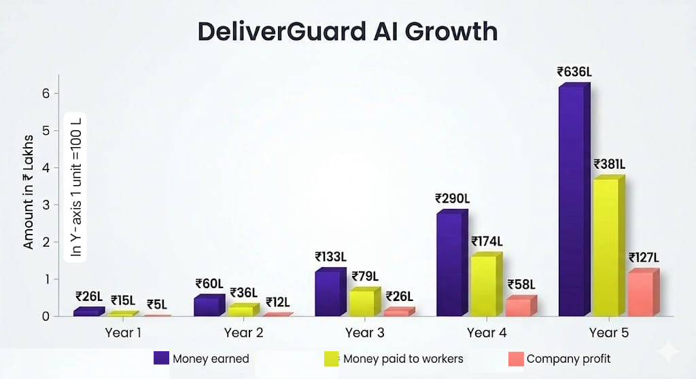

# DeliverGuard AI – Micro Insurance for Gig Workers

DeliverGuard AI is a parametric micro-insurance platform designed for delivery partners of Zomato.  
It protects workers from income loss caused by external disruptions such as rain, traffic, extreme heat, and environmental conditions.

The system uses AI monitoring, OCR verification, and fraud detection to ensure fair and automated payouts.

---

## Problem Statement

Delivery workers depend on daily or weekly earnings, but external factors such as:

- Heavy rain
- Flood
- Traffic congestion  
- Extreme heat  
- Environmental disturbances  
- Curfew / strike  

can reduce or completely stop their ability to work.

Currently, there is no reliable system to compensate short-term income loss.

---

## Deliverable Expectations and it's Solutions

| Expectations        | Solutions  |
|---------------------|------------|
| Onboarding          | OCR-based income extraction with simple user profiling |
| Risk Profiling      | AI-powered analysis using weather, AQI, traffic, and behavioral data |
| Policy Creation     | Weekly income-based pricing with dynamic risk evaluation |
| Claim Triggering    | Automated detection of disruptions (rain, AQI, traffic) |
| Payout Processing   | Secure and instant bank transfers |
| Analytics Dashboard | Real-time insights on claims, payouts, and risk trends |
| Fraud Detection     | GPS, IP tracking, device fingerprinting, and behavior analysis |

---

## Adversarial Defense & Anti-Spoofing

  

DeliverGuard AI implements a multi-layer fraud detection system that validates user activity using location, device, network, and behavioral signals. Each feature is designed to detect a specific type of fraud and contribute to a unified risk score.

---

#  Detection Layer

###  1. GPS Verification System

**Problem:**  
Users can spoof GPS using fake location apps, making it appear they are working when they are not.

**Solution:**  
Continuously validate location consistency instead of trusting a single GPS point.

**How it Works:**  
1. Collect GPS coordinates periodically (every few seconds)  
2. Store previous and current locations  
3. Calculate distance between points  
4. Detect abnormal jumps (e.g., 100 km in seconds)  
5. Flag inconsistent movement  

**Tech Stack:**  
- `navigator.geolocation`  
- Haversine formula  
 

---

###  2. IP Address Verification

**Problem:**  
User’s network location may not match their physical location.

**Solution:**  
Cross-check IP-based location with GPS coordinates.

**How it Works:**  
1. Extract IP address from request  
2. Use IP geolocation API to get location  
3. Compare IP location with GPS location  
4. Calculate distance mismatch  
5. Flag large inconsistencies  

**Tech Stack:**  
- ipapi / ipinfo  

---

###  3. VPN Detection Mechanism

**Problem:**  
Users can hide their real location using VPN or proxy services.

**Solution:**  
Detect anonymized IP addresses and unusual location switching.

**How it Works:**  
1. Check IP against VPN/proxy database  
2. Detect rapid country switching  
3. Identify high-risk IP patterns  
4. Mark suspicious sessions  

**Tech Stack:**  
- ipqualityscore  
- proxycheck.io  

---

###  4. Device & Emulator Detection

**Problem:**  
Fraudsters create multiple fake accounts using emulators.

**Solution:**  
Generate unique device fingerprint and detect emulators.

**How it Works:**  
1. Collect device information (OS, browser, screen)  
2. Generate hashed deviceId (SHA-256)  
3. Detect emulator signatures  
4. Track multiple accounts on same device  

**Tech Stack:**  
- FingerprintJS  
- Crypto hashing  

---

###  5. Movement & Speed Analysis

**Problem:**  
Fake GPS creates unrealistic movement patterns.

**Solution:**  
Analyze speed and movement consistency.

**How it Works:**  
1. Calculate distance between GPS points  
2. Compute speed = distance / time  
3. Detect:
   - No movement  
   - Unrealistic speed (>120 km/h)  
   - Sudden jumps  
4. Flag suspicious behavior  

**Tech Stack:**  
- Haversine formula    

---

###  6. Route Validation System

**Problem:**  
Fake routes do not follow real-world roads.

**Solution:**  
Compare user path with actual map routes.

**How it Works:**  
1. Track sequence of GPS points  
2. Map points onto real road network  
3. Detect invalid paths (through buildings/water)  
4. Validate route realism  

**Tech Stack:**  
- OpenStreetMap  
- Leaflet  

---

###  7. Log-Based Monitoring System

**Problem:**  
Fraud patterns cannot be identified from a single event.

**Solution:**  
Maintain historical logs for analysis.

**How it Works:**  
1. Store all tracking data (GPS, IP, device, timestamp)  
2. Analyze repeated anomalies  
3. Detect long-term suspicious patterns  
4. Flag repeat offenders  

**Tech Stack:**  
- MongoDB  
- Logging system

---

#  Intelligence Layer

###  8. Spatio-Temporal Correlation

**Problem:**  
Fraudsters operate in coordinated groups.

**Solution:**  
Analyze location and time relationships.

**How it Works:**  
1. Compare multiple users’ activity  
2. Identify same location + same time patterns  
3. Detect clustering behavior  
4. Flag coordinated activity  

**Tech Stack:**  
- MongoDB aggregation  

---

###  9. Shared IP & Device Detection

**Problem:**  
One attacker controls multiple accounts.

**Solution:**  
Detect shared device and IP usage.

**How it Works:**  
1. Store deviceId and IP for each user  
2. Group users with same identifiers  
3. Detect abnormal sharing  
4. Flag accounts for investigation  

**Tech Stack:**  
- Backend grouping logic  

---

###  10. Fraud Ring Detection

**Problem:**  
Large-scale fraud networks operate together.

**Solution:**  
Identify clusters of users with similar behavior.

**How it Works:**  
1. Analyze user patterns (routes, timing, devices)  
2. Detect repeated similarities across accounts  
3. Build clusters of related users  
4. Identify fraud networks  

**Tech Stack:**  
- Graph-based analysis  

---

###  11. Behavioral Pattern Analysis

**Problem:**  
Fake users behave unnaturally compared to real users.

**Solution:**  
Analyze behavioral patterns over time.

**How it Works:**  
1. Track delivery frequency and timing  
2. Identify unusual consistency  
3. Detect robotic or scripted behavior  
4. Flag anomalies  

**Tech Stack:**  
- Statistical models  

---

###  12. Multi-Signal Fusion Engine

**Problem:**  
Single signal is unreliable.

**Solution:**  
Combine all signals for stronger detection.

**How it Works:**  
1. Collect signals (GPS, IP, device, behavior)  
2. Assign weight to each signal  
3. Combine into unified decision  
4. Detect fraud based on multiple indicators  

**Tech Stack:**  
- Rule-based engine  

---

#  Risk Scoring System

###  13. Dynamic Risk Scoring

**Problem:**  
Not all anomalies indicate fraud.

**Solution:**  
Assign weighted risk scores.

**How it Works:**  
1. Each anomaly adds risk points  
2. Combine scores from all modules  
3. Calculate final risk score  
4. Classify user risk level  

**Tech Stack:**  
- Rule-based scoring system  

---

#  Final Insight

> DeliverGuard AI combines detection, intelligence, and risk scoring layers to build a robust, real-time fraud prevention system that ensures security while minimizing false positives. 

---

## System Workflow

1. Collect user data  
2. Validate inputs  
3. Analyze patterns  
4. Assign risk score  
5. Trigger actions  

---

## Insurance Plans

  

| Plan     | Premium | Hour Threshold | Max Weekly Payout |
|----------|--------|---------------|-------------------|
| Basic    | 5%     | 8 hrs         | ₹2000             |
| Standard | 8%     | 6 hrs         | ₹4000             |
| Premium  | 10%    | 4 hrs         | ₹8000             |

---

## Premium Calculation

Weekly Premium = Weekly Income × Plan %

Example (Weekly Income = ₹7000):

- Basic → ₹350  
- Standard → ₹560  
- Premium → ₹700  

---

## Payout Calculation

### Hourly Income
Weekly Income ÷ 42 (6 hours/day × 7 days)

### Claim Types
- Day Claim → 6 × Hourly Income  
- Hour Claim → Threshold × Hourly Income  

### Final Rule
Final Payout = min(calculated amount, plan limit)

---

## Disruption Detection

The system uses real-time APIs:

- Weather API → Rain / flood  
- AQI API → Pollution  
- Traffic API → Congestion  

Trigger conditions:

- Rainfall ≥ 50 mm/hr  
- AQI ≥ 300  
- Traffic ≥ defined threshold  

---

##  OCR-Based Income Verification

To ensure accurate and automated income verification, DeliverGuard AI uses **OCR (Optical Character Recognition)** powered by EasyOCR.

###  Why OCR is Used

- Eliminates manual verification of income proof  
- Automatically extracts data from transaction screenshots  
- Speeds up onboarding and claim validation  
- Reduces human errors and improves efficiency  

###  How It Works

1. The user uploads a screenshot of their transaction or earnings proof  
2. The system uses **EasyOCR** to extract text from the image  
3. Key details such as:
   - Platform name (e.g., Zomato, Swiggy)  
   - Transaction amount  
   - Date and time  
4. Extracted data is processed and structured in the system

  

Example:  
Input: 
INR 3139 credited via ZOMATO 
Output: 
Premium Rate : 8% (Standard Plan) Insurance Premium : ₹251

###  Fraud Prevention Mechanism

OCR alone cannot verify whether an image is original or edited. Therefore, DeliverGuard AI combines OCR with multiple validation techniques:

- Identifies inconsistent formatting in manipulated screenshots  
- Flags duplicate or reused images  
- Uses metadata analysis as an additional validation layer  

###  Cross-Verification with Delivery Platforms

To enhance reliability, the system can cross-verify user income with Zomato delivery platforms:

- The extracted income data is compared with actual earnings records  
- Ensures that the submitted screenshot matches real transaction history  
- Prevents fraud caused by edited or AI-generated screenshots  
- Acts as a strong validation layer beyond OCR  

> Since OCR only reads visible text, cross-verification ensures authenticity by validating the data from trusted sources.

###   Workflow

  

###   Technology Used

- **EasyOCR** – for text extraction from images  
- Image preprocessing – to improve OCR accuracy  
- Backend validation logic – for data matching  
- Platform verification (Zomato integration) – for authenticity checks  

---

## Loyalty Rewards

  

### Levels
- Silver → 3 months  
- Gold → 6 months  
- Diamond → 1 year  

### Benefits
- Fuel rewards  
- Premium discounts  
- Faster claim processing  
- Increased coverage  

---

## Features

- Smart onboarding  
- Weekly insurance plans  
- Automated claim system  
- Accurate payout calculation  
- Instant payouts  
- Multi-signal fraud detection  
- Location and movement validation  
- AI-based risk scoring  
- Loyalty rewards system  
- Interactive dashboard  
- Secure system design  

---

## Tech Stack

### Frontend
- React.js  
- Tailwind CSS  

### Backend
- Node.js  
- Express.js  

### Database
- MongoDB  

### APIs
- OpenWeather API  
- WAQI API  
- TomTom Traffic API  
- Maps API  

### Tools
- EasyOCR  

---

## Impact

- Helps delivery workers earn even when they can’t work due to rain or disruptions
- Reduces the stress of losing daily income
- Allows workers to stay safe instead of taking risks during bad conditions
- Provides quick support when their work is affected
- Builds trust with a simple and transparent system
- Rewards workers who stay consistent and active
- Gives more confidence and stability in their earnings

---

## Growth of Revenue

- Revenue increases consistently over time as the user base expands.
- Income-based premium model ensures revenue scales with worker earnings.
- Growth demonstrates strong scalability and long-term sustainability of the platform.

  

 

 > More users → More revenue → Higher profit
> 
- Claims increase but stay controlled  
- Profit grows steadily every year  

---

## Future Enhancements

- Integration with delivery platforms for real-time income tracking
- Advanced AI models for more accurate risk prediction
- Mobile app for easier access and real-time alerts
- Smarter fraud detection using machine learning
- Personalized insurance plans based on user behavior
- Expansion to more cities and gig worker categories
- Voice and regional language support for better accessibility
- Real-time notifications for disruptions and claim updates

---

## Conclusion

DeliverGuard AI transforms insurance into a smart, automated, and worker-centric system, ensuring protection from unpredictable income loss.
